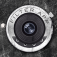

# Grungy

Grungy is a free photo un-enhancement app.

**[Try Grungy — free](https://adrian3.github.io/grungy/)**

For people who prefer wear-and-tear over glossy perfection, Grungy adds layers of scratches, worn borders, burns, and vignettes to your photos. Tap **Grunge** to discover a new combination, then make it as subtle or distressed as you like.

## Real textures. Beautiful imperfections.

The authenticity of the grunge comes from the care taken in gathering the textures that power this app. The grunge is hand-picked from a collection of artifacts like glue-tinted wallpaper, rusty vintage labels, film remnants, forest-fire enhanced panels, severely overexposed slides, sanded plexiglass, dry-transfer laser prints, solar graphs, monographs, ticket scraps, antique camera experiments, chemical stained darkroom remnants, thick layers of billboard paper, overused sandpaper, screen-printed collage, and drawers full of objects that clearly contain the marks and scars of their life.

## Make a little mess

- **Find something unexpected.** Random combinations of textures give each tap of Grunge a different look.
- **Turn it up or down.** Use **+** and **−** to adjust the intensity.
- **Choose your mood.** Work in color or black and white.
- **Keep a look you love.** Save your finished image to share it or use it in your next creative project.

## Give your photo some history

1. Open Grungy and choose **New** to load a photo.
2. Tap **Grunge** to explore different texture combinations.
3. Adjust the intensity with **+** and **−**. Open settings to change the color mode.
4. Tap **Save** to download your image. On mobile, you may need to open the downloaded image and save it to Photos.

The original app worked with **612 × 612 pixel** images; the web edition exports at the loaded image’s dimensions.

## From iOS to the web

Originally released for iOS, Grungy reached **47,131 App Store downloads**. It is now available free as a progressive web app (PWA), bringing the original textures and playful approach to photo editing back to your browser.

## Keep it on your home screen

Install Grungy for its own home screen icon and app window. Once the textures finish downloading, it works offline too. The first offline setup downloads about **120 MB** of textures; keep the app open until **Settings → Install Grungy** says it is ready.

**iPhone or iPad**
1. Open the app in **Safari**.
2. Tap **Share** (you may need to open the **Page Menu** first), then **Add to Home Screen**.
3. Turn on **Open as Web App** if that option appears, then tap **Add**.
4. Launch it from your home screen.

**Android**
1. Open the app in **Chrome**.
2. Tap **⋮** → **Add to home screen** → **Install** (or tap **Install Grungy** in the app’s settings when available).
3. Follow the prompts, then launch it from your home screen.

Need help? See [Apple’s home screen instructions](https://support.apple.com/guide/iphone/open-as-web-app-iphea86e5236/ios) or [Chrome’s installation guide](https://support.google.com/chrome/answer/9658361?co=GENIE.Platform%3DAndroid&hl=en).

---

Designed and developed by **[Ade Hanft](https://adrian3.com)**.
